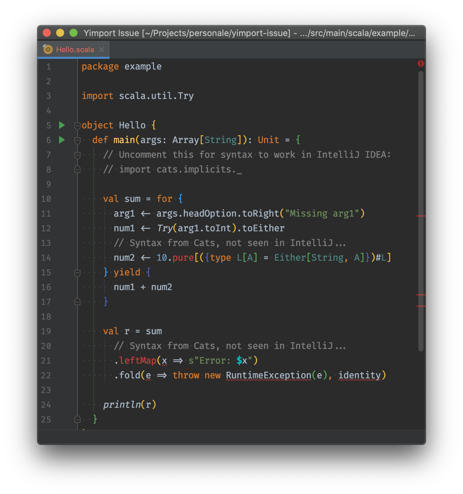

# -Yimport issue in IntelliJ IDEA

Scala 2.13 now supports `-Yimport` for customizing the default imports, see:

[PR #6764](https://github.com/scala/scala/pull/6764)

The Scala plugin for IntelliJ IDEA should support it:

[SCL-16562](https://youtrack.jetbrains.com/issue/SCL-16562)

Unfortunately at this point it seems to be having issues:

- IntelliJ IDEA 2019.3.2
- Scala plugin 2019.3.716 (nightly)

